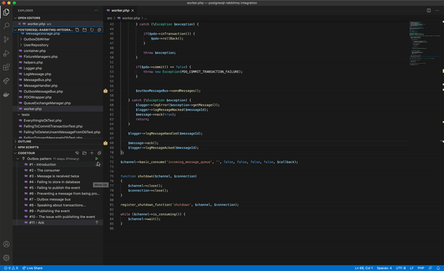

# PostgreSQL - RabbitMQ integration via the outbox pattern

This repo demonstrates how the outbox pattern solves PostgreSQL and RabbitMQ not being able 
to work transactionally.

## Challenges of integrating a database and a message broker
When integrating a database, such as PostgreSQL, and a message broker, here RabbitMQ, we want to ensure that:
- We're dealing with incoming messages in an idempotent way.
- We're not publishing messages if we weren't able to modify the state in the database.
- We're not changing state in the database without sending the corresponding event.

If the message broker and the database can't work together inside a transaction, we have to find a way 
to take care of previous challenges. The outbox pattern in one solution, and here is a possible 
implementation in PHP.

## Discovering the pattern
To discover the pattern, you can browse through the code or take the tour to guide you.

### Taking the tour
The tour is available with [Visual studio code](https://code.visualstudio.com/) and the [Code tour extension](https://marketplace.visualstudio.com/items?itemName=vsls-contrib.codetour).

